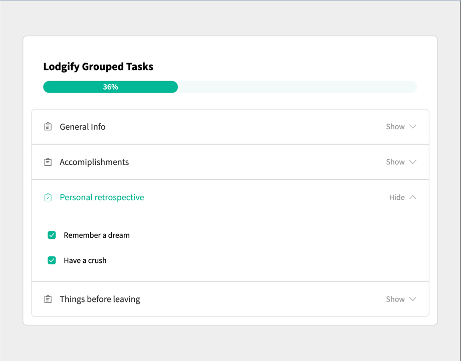

# Profile Creation Progress Widget

The Profile Creation Progress Widget is a React-based component designed to display and manage the progress of profile creation tasks.
It provides an `intuitive interface` for managing tasks within different areas, marking them as complete, and visualizing the overall progress.



# Features
- Displays the progress of profile creation.
- Organizes tasks into collapsible groups.
- Allows users to mark tasks as done or undone.
- Calculates progress based on the sum of the values of checked tasks.
- Highlights completed task groups in green.

# Technologies Used
- ReactJs
- Typescript
- Sass
 
# Getting Started with Create React App

This project was bootstrapped with [Create React App](https://github.com/facebook/create-react-app).

## Install dependencies

`npm install`

## Available Scripts

In the project directory, start the development server:

### `npm run start`

Runs the app in the development mode.\
Open [http://localhost:3000](http://localhost:3000) to view it in the browser.

The page will reload if you make edits.\
You will also see any lint errors in the console.

### `npm run test`

Launches the test runner in the interactive watch mode.\
See the section about [running tests](https://facebook.github.io/create-react-app/docs/running-tests) for more information.

### `npm run build`

Builds the app for production to the `build` folder.\
It correctly bundles React in production mode and optimizes the build for the best performance.

The build is minified and the filenames include the hashes.\
Your app is ready to be deployed!

See the section about [deployment](https://facebook.github.io/create-react-app/docs/deployment) for more information.

## Approach
In developing the Profile Creation Progress Widget, the structure involves the following:

- Designing the component hierarchy, including `Accordion, Checkbox, and ProgressBar` reusable components.
- Implementing data fetching using a `custom hook` (useFetchGroupTasksData) to fetch and manage profile creation task data.
- Creating the `UserProfileCreationProgressWidget` component, which uses the reusable components and `utility functions` to calculate and handle the logic of the working app. This component manages the state of task groups, allows users to expand/collapse groups, mark tasks as complete, and calculates the overall progress.
- Styling the components with `SASS` to match the provided figma design.
- Adding `TypeScript` for type safety.
- Writing `unit tests` for each component to ensure correctness.

## Commit Convention
To ensure readability and consistency in `commit messages`, the conventional commit format is used for writing commit messages that are `clear, concise, and informative`. 
Each commit message should adhere to the following pattern:

```
<type>(<scope>): <description>

[optional body]

[optional footer]

```

Where:

- `<type>` specifies the type of the commit (e.g., feat, fix, chore, docs, style).
- `<scope>` is optional and indicates the scope of the commit (e.g., component name, module).
- `<description>` is a short, concise description of the change.
- `[optional body]` provides additional context or details about the change.
- `[optional footer]` includes any relevant issue or breaking change references.

This convention helps in tracking and understanding the `purpose` of each commit.
See the section about [conventional commits](https://www.conventionalcommits.org/en/v1.0.0/#specification) for more information.

## Live Demo

The application is deployed on Netlify and can be accessed here:
https://lodgify-fe-technical-challenge.netlify.app/